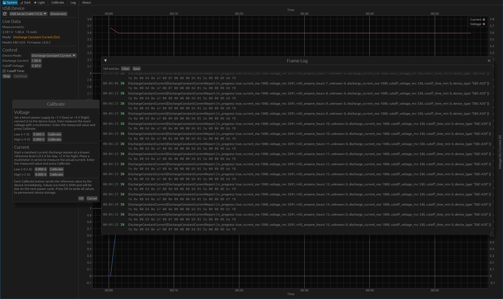
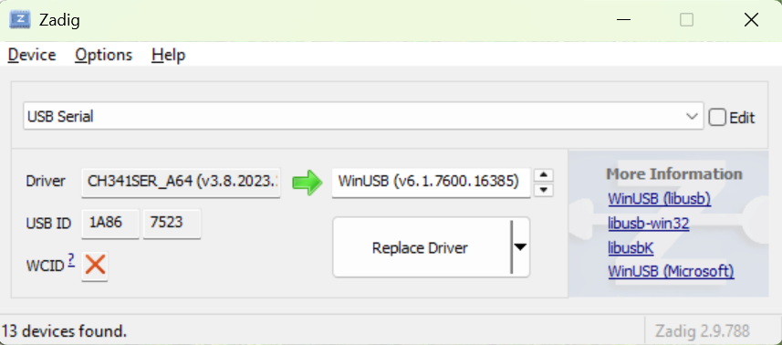

# EBC-A20 Battery Tester

Cross-platform desktop and browser application to control ZTE Tech EBC-A20
battery tester.



The deployed web app is available at
[mauri.codes/ebc-battery-tester](https://mauri.codes/ebc-battery-tester). Before
using the web app, follow the [WebUSB setup](#access-usb-device-on-browser) for
your OS to allow the browser to access the device.

Native desktop binaries for Linux and Windows can be downloaded from the [GitHub
releases page](https://github.com/Kazhuu/ebc-battery-tester/releases). This
should work out of the box with default drivers. If you did the WebUSB setup
above, you need undo that in order for native app to discover the serial port.

Also check [Important Notes](#important-notes) before running the app.

If you are interested about the protocol documentation, check [Frame
Reference](#frame-reference).

The app is built with Rust using [egui](https://github.com/emilk/egui) and
[eframe](https://github.com/emilk/egui/tree/master/crates/eframe).


## Table of Contents

- [EBC-A20 Battery Tester](#ebc-a20-battery-tester)
  - [Table of Contents](#table-of-contents)
  - [Missing Features](#missing-features)
  - [Important Notes](#important-notes)
  - [Access USB Device on Browser](#access-usb-device-on-browser)
    - [Windows](#windows)
    - [Linux](#linux)
  - [Reverse Engineering](#reverse-engineering)
    - [General Notes](#general-notes)
    - [Frame Reference](#frame-reference)
    - [Firmware Extraction Scripts](#firmware-extraction-scripts)
  - [Development](#development)
    - [Native Target Locally](#native-target-locally)
    - [Web Locally](#web-locally)
    - [VSCode WASM Target](#vscode-wasm-target)
    - [CI Checks](#ci-checks)
    - [Rustfmt](#rustfmt)
    - [Clippy](#clippy)
    - [Creating a Release](#creating-a-release)
  - [Important Resources](#important-resources)

## Missing Features

These are missing features compared to the original Windows software.

- Send 1 minute time sync frames to the device.
- Control multiple devices from one software session.
- Cycles configuration.
- Plot saving as an image.
- Data exporting to a CSV file.
- Support for other devices than EBC-A20.
- Firmware update.

These are things that requires attention from development perspective

- Clean up UI code and split it to smaller pieces.
- Add tests.

## Important Notes

The browser version uses WebUSB to communicate with the device. WebUSB is only
supported on Chrome, Edge and Opera; for example, the web app will not work with
Firefox.

Only the USB cable that ships with the device is
supported. The cable has a built-in CH340 serial chip, even though the device
end is a mini USB plug, so any regular mini USB cable will not work.

## Access USB Device on Browser

This configuration is only needed if you run the app via web browser. Native
apps work out of the box.

By default WebUSB cannot access the device from the browser as OS driver has
already claimed the device, locking the browser out. In order to use WebUSB, you
need to do additional steps. Read the steps for your OS below.

### Windows

On Windows you most likely installed the driver that came with the original app.
This driver will claim the device when you plug in the USB cable. Hence the
browser will not be able to access the device. You need to change the driver
with more generic WinUSB driver. When you do this, the COM port will not appear
in the original Windows software anymore. To return the old behavior, you can
always install the original manufacturer driver using the software bundled
with the Windows app.

To change the driver on Windows:

1. Download [Zadig](https://zadig.akeo.ie/) and run it.
2. In the menu, click `Options` and ensure `List All Devices` is checked.
3. From the dropdown select `USB Serial`.
4. On the right `Target Driver`, ensure WinUSB is selected, see the screenshot below.
5. Click `Replace Driver`.



Unplug and plug the USB cable back to the machine. You should now be able to
connect to the device using WebUSB.

### Linux

When you plug in the USB cable, Linux `ch341` driver will claim the USB device
and you cannot connect to it using WebUSB anymore. You need to unbind it first.
You can do one time unbind with following command. This will work until you plug
in the USB cable again.

```bash
sudo sh -c 'echo "1-2.3:1.0" > /sys/bus/usb/drivers/ch341/unbind'
```

If you want to automatically unbind this when the cable is plugged in, you can
add the following udev rule

```bash
sudo tee /etc/udev/rules.d/99-ebc-tester.rules << 'EOF'
# Allow browser access to EBC battery tester (CH340, vid:1a86 pid:7523)
SUBSYSTEM=="usb", ATTRS{idVendor}=="1a86", ATTRS{idProduct}=="7523", MODE="0664", TAG+="uaccess"

# Release ch341 kernel driver immediately after it binds, so WebUSB can claim the interface
ACTION=="bind", SUBSYSTEM=="usb", ATTRS{idVendor}=="1a86", ATTRS{idProduct}=="7523", DRIVER=="ch341", RUN+="/bin/sh -c 'echo %k > /sys/bus/usb/drivers/ch341/unbind'"
EOF
```

Then reload the udev rules with

```bash
sudo udevadm control --reload-rules
```

Now you should be able to connect to the serial port with WebUSB.

This will prevent using the native app as it will not be able to connect to the
USB port anymore. To restore the original behavior, just remove the udev rule
added above.

## Reverse Engineering

### General Notes

See [REVERSE_ENGINEERING.md](REVERSE_ENGINEERING.md) for my reverse engineering
notes.

### Frame Reference

See [FRAMES.md](FRAMES.md) for the complete frame format reference for EBC-A20
model.

### Firmware Extraction Scripts

Two Python scripts in the project root help you to extract the original firmware
in two ways.

**`extract_firmware_from_exe.py`** — extracts all device firmware images from
the Windows software exe file. The firmware files are not included in this repo
for legal reason, but you can easily dump them on your own with this script.
This will output the extracted firmware in `fw_out` folder in project root.

```bash
python3 extract_firmware_from_exe.py ebc-tester.exe
```

**`extract_firmware.py`** — extracts firmware from a Wireshark USB capture
recorded during a live firmware update performed with the original Windows
software. Feed it the `.pcap` file and it reconstructs the firmware binary.

```bash
python3 extract_firmware.py firmware-update.pcap firmware_extracted.bin
```

Both scripts produce identical output for the EBC-A20:
`fw_out/firmware_id9_EBC-A20.bin`.

## Development

### Native Target Locally

To develop the app locally with auto compile, run

```bash
cargo-watch -x run
```

### Web Locally

You can compile your app to [WASM](https://en.wikipedia.org/wiki/WebAssembly)
and publish it as a web page.

We use [Trunk](https://trunkrs.dev/) to build for web target.

1. Install the required target with `rustup target add wasm32-unknown-unknown`.
2. Install Trunk with `cargo install --locked trunk`.
3. Run `trunk serve` to build and serve on `http://127.0.0.1:8080`. Trunk will rebuild automatically if you edit the project.
4. Open `http://127.0.0.1:8080/index.html#dev` in a browser. See the warning below.

> `assets/sw.js` script will try to cache our app, and loads the cached version when it cannot connect to server allowing your app to work offline (like PWA).
> appending `#dev` to `index.html` will skip this caching, allowing us to load the latest builds during development.

### VSCode WASM Target

By default, VSCode and rust-analyzer compile and show errors for the native
target. To get errors and code completion for the WASM target instead, uncomment
the following line in [.vscode/settings.json](.vscode/settings.json):

```json
"rust-analyzer.cargo.target": "wasm32-unknown-unknown",
```

Remember to revert this when switching back to native development.

### CI Checks

To run all CI checks locally at once, use the provided script

```bash
./check.sh
```

This runs cargo check, formatting, Clippy, tests and a Trunk WASM build.

### Rustfmt

This project uses rustfmt for code formatting. There is also a CI check that
enforces correct formatting. Run the formatter locally with

```bash
cargo fmt
```

To only check without modifying files, run

```bash
cargo fmt -- --check
```

### Clippy

This project uses Clippy linter. There is also a CI check that fails on any
warnings. Run Clippy locally with

```bash
cargo clippy --target wasm32-unknown-unknown
```

### Creating a Release

1. Bump the version in `Cargo.toml`.
2. Commit and push to main, then wait for CI to pass.
3. Tag the commit with the matching version and push the tag:

```bash
git tag v<version>
git push --tags
```

The release workflow will validate that the tag matches the version in `Cargo.toml`,
build Linux, Windows and WASM targets, and publish a GitHub release with all three
as downloadable assets.

## Important Resources

- [ZKETECH EBC-A20 reverse engineering blog post](https://pop.fsck.pl/hardware/zketech-ebc-a20.html) —
  the starting point for the protocol work; incomplete and contains some inaccuracies.
- [Python CLI tool for EBC devices](https://gist.github.com/enkiusz/6408645efd622b8a638a14957cd37f47) —
  command-line tool to control an EBC device from Python.
- [WebUsbSerialTerminal serial.js](https://github.com/selevo/WebUsbSerialTerminal/blob/main/serial.js) —
  example code for configuring the CH340 serial chip via WebUSB (baud rate, parity, etc.).
